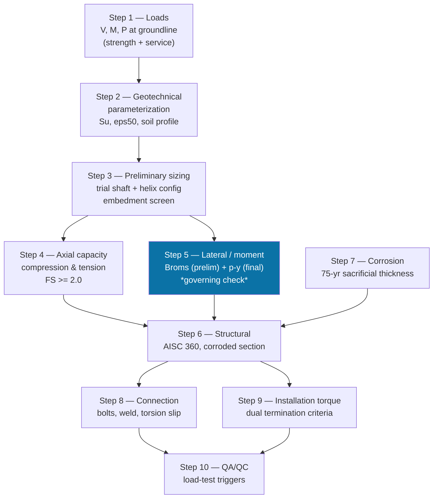

# Helical Pile Design — Process Workflow

The engineering procedure this package implements: how to take a lighting
pole and a soil report and arrive at a sized, checked, specifiable helical
pile foundation. Ten steps, each with one governing question, each
implemented 1:1 by one module in `src/helical_pile_design/`. This document
describes the *procedure*; see `README.md` for the codebase and
`workflow.md` for running the tools.

## Flow

Step 5 is marked because for a light-pole helical pile — high moment,
low axial load, short embedment — lateral/moment capacity almost always
governs, not axial capacity. Steps 3-9 aren't strictly linear: Step 7's
corroded wall thickness feeds Step 6, and Step 3's trial geometry feeds
both Step 4 and Step 5 in parallel. Step 10 is a rule engine that reads
flags produced by every step before it, not a calculation of its own.

## Step 1 — Load determination

**Question:** what force does wind put on the pile at grade?

- **Inputs (A1-A7):** pole geometry and weight, luminaire EPA and weight,
  basic wind speed, exposure coefficients (Kz), directionality (Kd), gust
  factor (G).
- **Method:** AASHTO LTS-6 wind pressure on pole and luminaire projected
  areas, resolved to groundline shear (V), moment (M), and axial (P).
  Computed twice — a **strength** case (factored, long-MRI wind) and a
  **service** case (~10-yr MRI wind) — because Step 5's two checks each
  need one.
- **Output:** `Reactions(V, M, P, e=M/V, Tz)`. `Tz` (torsion) is nonzero
  only for single-arm poles with an eccentric luminaire.

## Step 2 — Geotechnical parameterization

**Question:** what soil parameters does the design actually use?

- **Inputs:** SPT N60 or CPT qt, or lab UU/CU data.
- **Method:** correlate to undrained shear strength (Su) for clay, or
  friction angle (phi') for sand; derive Matlock eps50 from Su.
- **Output:** design soil profile. **Prefer lab/CPT over SPT correlation**
  — the basis used here is tracked and feeds a Step 10 trigger if it's
  SPT-only.

## Step 3 — Preliminary sizing

**Question:** what shaft and helix configuration do we even start
checking?

- **Method:** a rough shaft-diameter heuristic from the design moment,
  rounded up to a standard commercial OD (168/219/273/324 mm); a trial
  helix configuration (diameters + depths); then two embedment screens —
  frost depth clearance and a "deep foundation" depth-to-diameter check.
- **Output:** trial geometry, carried into Steps 4 and 5. This is a
  *starting point*, not a sizing equation — Steps 4-6 are what actually
  validate it. If Step 4 or 5 fails by a wide margin, come back here and
  resize.

## Step 4 — Axial capacity

**Question:** does the pile resist crushing down or pulling up, with
FS >= 2.0?

- **Compression — two independent methods, lesser governs:**
  - *Individual bearing*: sum of helix bearing (9·Su·A_h per plate) plus
    shaft adhesion above the top helix.
  - *Cylindrical shear*: bearing at the bottom helix only, plus shear
    along the soil cylinder between helices, plus the same shaft
    adhesion term. Governs when helices are closely spaced (small soil
    cylinder can't develop full individual bearing on each plate).
- **Tension**: helix bearing in uplift, checked against **frost-uplift
  demand** (adfreeze bond on the shaft within the frost zone) — usually
  the controlling tension case for a lighting pole, not wind uplift.
- **Output:** governing method + FS for each direction.

## Step 5 — Lateral and moment capacity (the governing check)

**Question:** does the pile stay upright and within deflection/rotation
limits under wind moment?

- **5a. Broms (preliminary)** — closed-form free-head short-rigid-pile
  solution in clay. Fast, conservative-ish, used as a first pass and as
  an independent cross-check on the p-y result (same order of magnitude,
  not tight agreement — they're different methods).
- **5b. p-y (final)** — beam-on-nonlinear-Winkler-foundation finite
  element solve, Matlock soft-clay p-y curves, iterated to convergence.
  Same formulation LPILE uses. Run three ways:
  - **Serviceability**: at service loads, check groundline deflection and
    rotation against limits (12 mm / 0.5° default — confirm with owner).
  - **Strength**: at factored loads, extract peak moment down the shaft
    (feeds Step 6) and confirm a "toe kick-back" (deflected-shape sign
    reversal) is present — its absence means the embedment isn't deep
    enough to develop fixity, independent of whether deflection passes.
  - **Pushover**: scale the strength load by increasing multipliers (λ)
    until the solver fails to converge or deflection runs away.
    λ_ult / λ_required(=1.0) is the ultimate-capacity FS; required >= 2.0.
- **Output:** service pass/fail, strength M_max (→ Step 6), pushover FS.
  P-y soil parameters that are SPT-correlation-only (not lab/CPT) trigger
  Step 10.

## Step 6 — Structural checks

**Question:** does the steel shaft itself survive, at its *corroded*
end-of-life section?

- **Method:** AISC 360 — section compactness (D/t vs. limit), combined
  axial + flexure (H1 interaction, using Step 5's M_max and Step 4/1's
  axial demand), shear (trivially satisfied for light poles, checked
  anyway), a trigger for whether column buckling needs a separate check
  (weak/soft continuous soil layers), and installation-torque-vs-rating.
- **Critical rule:** every check here uses the **corroded** wall
  thickness from Step 7, never nominal — enforced by parameter naming
  (`t_c`, no `t_nominal` argument exists to pass by mistake).

## Step 7 — Corrosion design

**Question:** how much wall thickness is left after the design life?

- **Method:** galvanizing (zinc) provides sacrificial protection for its
  service life (thickness / corrosion rate); once consumed, bare steel
  corrodes at a second rate for the remaining design life. Combine into a
  sacrificial thickness, subtract from nominal wall to get `t_corroded`.
  A resistivity/pH screen classifies overall soil corrosivity.
- **Output:** `t_corroded` — feeds directly into Step 6.

## Step 8 — Pole-to-pile connection

**Question:** does the connection actually transfer the load into the
shaft?

- **Method:** anchor bolts (combined tension from overturning moment plus
  bending from any leveling-nut standoff, checked as a single combined
  stress against bolt Fu); an all-around fillet weld (shaft-to-cap-plate,
  treated as a weld line under combined moment + shear); torsional slip
  resistance for single-arm poles (pile's torsional friction capacity
  must exceed 3× the torsion demand from an eccentric luminaire arm).

## Step 9 — Installation torque specification

**Question:** what torque (and depth) does the installer need to hit in
the field to certify the axial capacity assumed in Step 4?

- **Method:** empirical torque-to-capacity correlation, `T_min = (FS ×
  P_required) / Kt`. **Kt must come from an AC358 product evaluation
  report or a site load test — never an assumed generic value** for
  large-diameter shafts without validation (this is exactly what a Step
  10 trigger checks for). Two termination criteria apply simultaneously —
  minimum torque **and** minimum depth from Step 3/5 — torque can never
  waive the depth requirement.

## Step 10 — QA/QC and load-test triggers

**Question:** given everything assumed above, does this design require a
full-scale load test before production?

- **Method:** a rule engine, not a calculation — it reads flags carried
  from every prior step (Kt not AC358-verified, frost-uplift relying on
  assumed bond stress, p-y parameters from SPT correlation only, low
  serviceability margin, large production quantity or variable soils) and
  maps them to the specific ASTM test standard each one triggers
  (D1143/D3689/D3966).

## Conventions that hold across every step

- **SI units internally, everywhere** — convert only at the display/report
  layer.
- **Ultimate vs. service is never conflated.** Every factor of safety is
  an explicit, named constant or parameter — never hidden inside a
  formula.
- **Every result carries its equation basis and code citation**, not just
  a number, so a reviewer can trace any output back to the specific
  design-doc section and equation that produced it.
- **Assumptions are marked, not buried.** Anything not independently
  verified (Kt, pile torsional slip capacity, bolt thread-root section
  modulus, tau_ad) is labeled `[ASSUMED — validate]` in the app and
  surfaces as a Step 10 trigger where the procedure calls for one.
